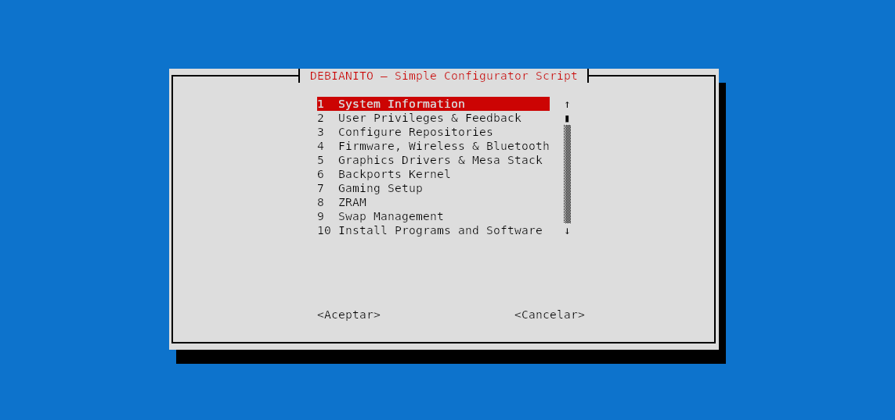

<h1 align="center">Debianito - Post-Installation Automation for Debian</h1>

<div align="center">

Debianito is a user-friendly post-installation automation script for Debian 11 (Bullseye), Debian 12 (Bookworm) and Debian 13 (Trixie). It streamlines system configuration, driver installation (including NVIDIA drivers), repository setup with backports support, gaming tools integration, and more with an interactive menu-driven interface.

[](https://github.com/stornic56/debianito-post-install/blob/main/LICENSE)


</div>

---

## System Requirements

| Requirement | Specification |
|-------------|---------------|
| **OS**      | Debian 11 (Bullseye), Debian 12 (Bookworm), Debian 13 (Trixie) |
| **Privileges** | Normal user with `sudo` access, script validates root/sudo in utils.sh |
| **Terminal**   | Any modern terminal emulator supporting ANSI colors and UTF-8 box-drawing characters |
| **Dependencies**     | Standard Debian packages (`whiptail`, `lsb-release`); auto-installed if missing |

---

## Installation Instructions

Clone the repository, make the script executable, and run it:

```bash
git clone https://github.com/stornic56/debianito-post-install
cd debianito-post-install
chmod +x debianito.sh && ./debianito.sh
```

> ⚠️ **Do not run as root.** The script checks for non-root execution and requires sudo privileges.

---

## Usage 

After running the script:

1. **Select Option:** Use arrow keys or type 1-10.
2. **Navigation:** Use Arrow Keys (Up↑/Down↓) to move between list options and ENTER key to confirm selection.
3. **Confirm Actions:** Installation prompts use whiptail for TUI confirmations.
4. **Review System Info:** Header displays detected Debian version and hardware summary before each action.
5. **Repeat as Needed:** Return to main menu at any time or exit when done.

| Option | Description | What it does |
|--------|-------------|--------------|
| **1** | [System Info](/docs/system_info.md) | Show detected OS, CPU, RAM, GPU and hardware details |
| **2** | [User Privileges & Feedback](/docs/user_priv_feed.md) | Configure sudo group membership, enable passwordless sudo for frequent tasks, repair home directory ownership issues, and toggle visual password feedback (asterisks) in terminal |
| **3** | [Configure Repositories](/docs/repos_config.md) | Setup official repos with non-free/contrib options, optional Backports support and Deb822/classic format injection.|
| **4** | [Firmware, Wireless & Bluetooth](/docs/firmware.md) | Install essential firmware for GPUs and wireless|
| **5** | [Graphics Drivers & Mesa Stack](/docs/gpu.md) | Configure AMD/Intel/NVIDIA drivers and Mesa graphics stack + monitoring tools |
| **6** | [Backports Kernel](/docs/kernel.md) | Install latest kernel from Debian backports|
| **7** | [Gaming Setup ](/docs/gaming.md)| Steam, Heroic Games Launcher, [RetroArch](/docs/retroarch.md) GameMode, MangoHud, OpenRGB, Java JRE (Temurin 8/17/21) |
| **8** | [ZRAM](/docs/zram.md)| Configure compressed RAM for memory optimization|
| **9** | [Swap Management](/docs/swap.md)| Manage swap file or partition size and enable/disable swap space for system stability|
| **10** | Install Programs and Software | Browse and install packages by category (Development, Themes, System Tools, etc.) using APT |
| **11** | [Boot Rescue + GRUB](/docs/boot.md))| Config and fix GRUB bootloader issues, chroot repair, or restore system boot configuration|
| **12** | [Desktop & Display](/docs/desktops_display.md)| Install and configure desktops and display managers|
| **13** | Exit | Return to terminal |

### Install Programs and Software (Option 10)

The submenu offers the next categories:

| Option | Category Title | Description |
|--------|-------------------------------|-------------|
| **0** | Essential Pack | Quick install of common tools (compression, system info, VLC, MS fonts)|
| **1** | Customization System | Desktop themes, icon themes, cursor themes, and fonts |
| **2** | Download & Network | Downloaders (aria2, ytdlp, FileZilla) + Torrent clients (qBittorrent, Deluge, Transmission) |
| **3** | Internet (Browsers, Email Clients, VPN) | Web browsers (Firefox/Mozilla, LibreWolf, Floorp, Chromium, Brave, Tor), email client (Thunderbird), and VPN tools (RiseUp, Proton, Mullvad)|
| **4** | Media Players | Multimedia playback with VLC media player and MPV for advanced video/audio support |
| **5** | Multimedia & Design | image editing (GIMP), video editing (Kdenlive, HandBrake), 3D modeling (Blender), audio recording (Audacity), and graphics design (Inkscape) |
| **6** | Code Editors & IDEs | vim, vim-gtk3, Neovim, Helix, nano, Emacs, Kate, Mousepad, Gedit, Geany, GNOME Text Editor, and VSCodium (VS Code open-source) |
| **7** | Servers & Dev Tools | Web servers (Nginx/Apache), databases (PostgreSQL/MariaDB), Java Development Kit (Temurin 17/21/25 JDK), Docker, Python, SSH tools, Jellyfin Server and essential utilities |
| **8** | Security & Networking | Wireshark, tcpdump, Zenmap, ClamAV, UFW, fail2ban |
| **9** | Software Centers | Choose a software store to install. |
| **10** | Office & Productivity | Choose a software store to install. |
| **12** | System Tools | htop/btop, ncdu, Timeshift, tmux/screen, nvme-cli, Flatpak support, extension repository manager and qemu/virtmanager |
| **12** | Fetch / System Info | fastfetch/neofetch, hyfetch, Linux logo and screenfetch |
| **13** | Back to Main Menu | Return directly to the main Debianito menu (exit submenu) |

---

## File Structure

| Directory/File | Description |
|----------------|-------------|
| `debianito.sh` | Main entry point; handles menu navigation and system detection. |
| `docs/` | Documentation directory containing Markdown files for each module. |
| `modules/` | Core modular scripts organized by category: repos, gpu, gaming, kernel, firmware, zram, etc. |
| `modules/bullseye/` | Legacy Debian 11 (Bullseye) specific modules: `extras.sh`, `legacy.sh`, `repos.sh`. |
| `modules/extras/` | Software installer sub-modules split by category (themes, downloaders, internet, dev tools, etc.). |
| `modules/gaming/` | Gaming launcher and optimization scripts: Steam, Heroic, Lutris, performance tools. |
| `modules/gpu/` | GPU driver installation scripts for AMD and NVIDIA with architecture detection. |
| `modules/repos/` | Repository management scripts: migration tool (`migrate.sh`) and format detection (`repo_detect.sh`). |

```bash
├── debianito.sh
├── docs
│   ├── firmware.md
│   ├── gaming.md
│   ├── gpu.md
│   ├── kernel.md
│   ├── repos_config.md
│   ├── retroarch.md
│   ├── system_info.md
│   ├── user_priv_feed.md
│   └── zram.md
├── media
│   └── gift
│       └── script.gif
├── modules
│   ├── bluetooth.sh
│   ├── bullseye
│   │   ├── extras.sh
│   │   ├── legacy.sh
│   │   └── repos.sh
│   ├── desktop_display.sh
│   ├── extras
│   │   ├── design
│   │   │   └── design.sh
│   │   ├── dev
│   │   │   ├── dev.sh
│   │   │   └── jellyfin.sh
│   │   ├── download
│   │   │   └── download.sh
│   │   ├── essential
│   │   │   └── essential.sh
│   │   ├── fetch
│   │   │   └── fetch.sh
│   │   ├── _helpers.sh
│   │   ├── internet
│   │   │   └── internet.sh
│   │   ├── java.sh
│   │   ├── office
│   │   │   └── office.sh
│   │   ├── players
│   │   │   └── players.sh
│   │   ├── programming
│   │   │   └── programming.sh
│   │   ├── security
│   │   │   └── security.sh
│   │   ├── system
│   │   │   ├── software_centers.sh
│   │   │   └── system.sh
│   │   └── themes
│   │       ├── cursors
│   │       │   └── cursors.sh
│   │       ├── desktop-themes
│   │       │   └── desktop-themes.sh
│   │       ├── fonts
│   │       │   └── fonts.sh
│   │       ├── icons
│   │       │   └── icons.sh
│   │       └── themes.sh
│   ├── extras.sh
│   ├── firmware.sh
│   ├── gaming
│   │   ├── _helpers.sh
│   │   ├── heroic.sh
│   │   ├── steam.sh
│   │   └── tools.sh
│   ├── gaming.sh
│   ├── gpu
│   │   ├── amd_intel.sh
│   │   ├── _helpers.sh
│   │   └── nvidia.sh
│   ├── gpu.sh
│   ├── kernel.sh
│   ├── repos
│   │   ├── migrate.sh
│   │   └── repo_detect.sh
│   ├── repos.sh
│   ├── rescue.sh
│   ├── sudo_config.sh
│   ├── swap.sh
│   ├── sysinfo.sh
│   ├── utils.sh
│   └── zram.sh
└── README.md
```
---

> 🤖 **AI-Assisted Development Note**  
> This project was developed with assistance from large language models for code generation, documentation and testing suggestions. The author takes full responsibility for the accuracy of all scripts included in this repository. All modifications have been reviewed manually before inclusion to ensure compatibility with Debian systems.
